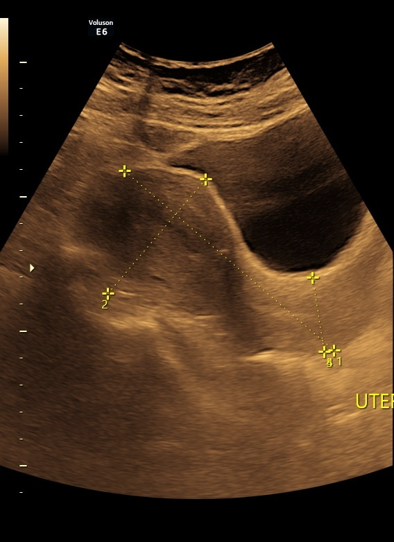
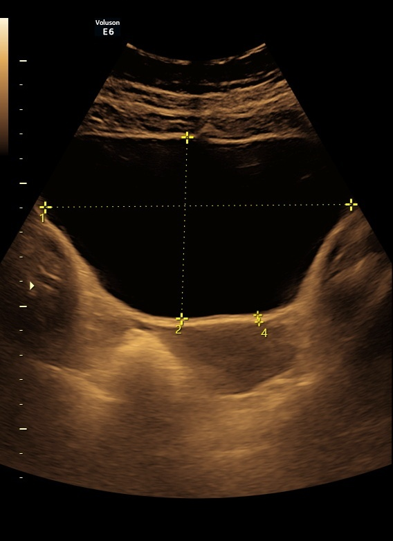
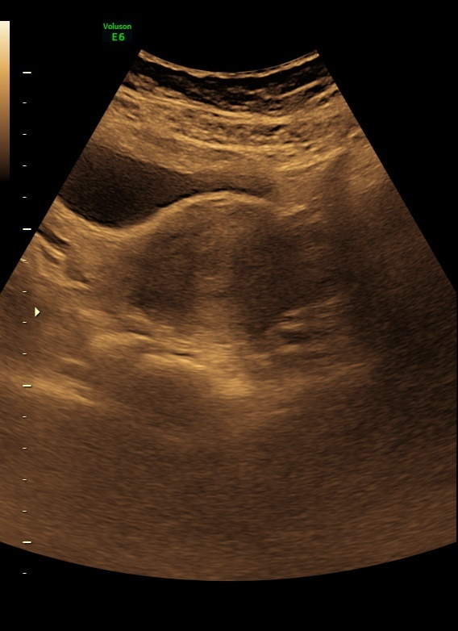
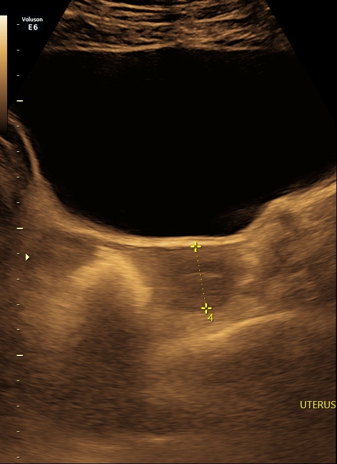
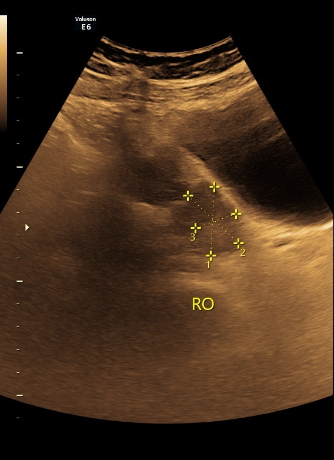

### Attention Enhanced Learnable 2D Gaussian Filters for Computationally Efficient Abdominal Organ Classification

## Key Features
- Gaussian 2D layer 
- Supervised learning 
- VGG16, ResNet50, DenseNet121, AlexNet, Custom CNN 
- Ultrasound imagery
- Squeeze and Excitation (SE) and Efficient Channel Attention (ECA)

## Abstract
Medical image processing plays a crucial role in disease diagnosis and clinical decision-making, demanding highly accurate and efficient classification models. However, state-of-the- art deep learning models used for medical image classification typically have large parameter counts, making them computationally intensive and unsuitable for real-time applications. To
address this challenge, this paper introduces a novel, computationally efficient neural network architecture incorporating a learnable 2D Gaussian filter for the real-time classification of abdominal organs. Unlike traditional convolutional layers, the proposed 2D Gaussian filter requires only four learnable parameters, two means and two standard deviations corresponding to
each spatial axis, significantly reducing computational complexity. Comparative evaluations were conducted against prominent baseline models, including VGG-16, ResNet-50, DenseNet-121, AlexNet, and a custom CNN. The proposed model achieved an accuracy of 87.81%, substantially outperforming the baseline models while maintaining the lowest parameter count. Further-
more, the performance of the proposed architecture was further enhanced by integrating attention mechanisms such as Squeeze-and-Excitation (SE), and Efficient Channel Attention (ECA-Net). Among these, the SE mechanism with 64 filters provided the best performance, achieving an accuracy of 91.22%, along with marked improvements in Precision, Recall, and F1 scores,
with only a minimal increase in parameters. This study thus demonstrates the potential of the proposed model for efficient and accurate real-time medical image processing.


## Dataset
- Custom curated ultrasound dataset  
- Not publicly available due to privacy and sensitivity concerns  


##  Sample Ultrasound Images

<p align="center">
  
  
  
</p>

<p align="center">
  
  
</p>


## Motivation
For real-time clinical use, medical image classification requires both efficiency and accuracy. However, the majority of cutting-edge deep learning models have a high number of parameters and are computationally demanding, which restricts their practical application. Because of this, there is a need for high-performing, lightweight architectures that strike a balance between speed and accuracy, allowing for scalable and useful healthcare solutions.


### Results
Training and validation loss curve 1 and Confusion matrix 1 show the impacts of SE block in the architecture.Training and validation loss curve 2 and Confusion matrix 2 show the baseline model's persormance.
| Loss Curve 1 | Loss Curve 2 |
|-------------|-------------|
| [Training and validation loss 1](Results/stv-2.png) | [Training and validation loss 1](Results/gse.png) |

| Confusion matrix 1  | Confusion matrix 2  |
|-------------|-------------|
| [Confusion matrix 1](Results/sc.png) | [Confusion matrix 2](Results/gsec.png) |


# Project Structure

```
├── assets/                         # Folder containing sample dataset images
│   ├── 1.png
│   ├── 2.png
    ├── 3.png
    ├── 4.png
    ├── 5.png
├── Results                         # Folder containing images of results
│   ├── alexnet_acc.png
│   ├── alexnet_class.png
│   ├── custom_cnn_acc
|   ├── custom_cnn_class
├── Codes
    ├── alexnet.py                      # Training and evaluation using AlexNet
    ├── dense-121.py                    # Training and evaluation using DenseNet121
    ├── resnet50_paper_fif.py           # Training and evaluation using ResNet50
    ├── vgg_16_PAPER_fif.py             # Training and evaluation using VGG16
    ├── custom_cnn_paper_fif.py         # Training and evaluation of custom CNN
    ├── gauss_final.py                  # Custom CNN with Learnable 2D Gaussian layer
    ├── gaussiand2D_layer_pytorch.py    # Script defining the learnable 2D Gaussian layer
    ├── create_dataset.py               # Dataset loading and preprocessing
    ├── ece+32.py                       # Training and evaluation of ECE attention Custom CNN with Learnable 2D Gaussian layer (32 filters)
    ├── ece+64.py                       # Training and evaluation of ECE attention Custom CNN with Learnable 2D Gaussian layer (64 filters)
    ├── SE_att.py                       # Training and evaluation of SE attention Custom CNN with Learnable 2D Gaussian layer (32 filters)
    ├── se+64.py                        # Training and evaluation of SE attention Custom CNN with Learnable 2D Gaussian layer (64 filters)
├── Cross Validation
    ├── cross_val_alex.py                      
    ├── cross_val_cnn.py                    
    ├── corss_val_dense_fif.py           
    ├── Cross_val_vgg.py             
    ├── cross_val_res.py         
    ├── cross_val_gauss.py
    ├── cross_val_se64.py                     
├── requirements.txt/              
├── .gitignore                      # Specifies files and folders to be ignored by Git
├── README.md                       # Reading this!

```       


```bash
# Clone this repo
git clone https://github.com/sifat1992/SEPIAD.git
cd SEPIAD

# Install dependencies
pip install -r requirements.txt
```

# Dataset: 
A curated ultrasound image dataset developed for this research is publicly available at Mississippi State University Scholars Junction:  
https://scholarsjunction.msstate.edu/research-data/5/

## References

1. Huang, G., Liu, Z., Van Der Maaten, L., & Weinberger, K.  
   “Densely Connected Convolutional Networks.” [arXiv:1608.06993](https://arxiv.org/pdf/1608.06993)

2. Simonyan, K., & Zisserman, A.  
   “Very Deep Convolutional Networks for Large-Scale Image Recognition.” [arXiv:1409.1556](https://arxiv.org/pdf/1409.1556)

3. He, K., Zhang, X., Ren, S., & Sun, J.  
   “Deep Residual Learning for Image Recognition.” [arXiv:1512.03385](https://arxiv.org/pdf/1512.03385)

4. Biswas, S., Ayna, C. O., & Gurbuz, A. C.  
   “PLFNets: Interpretable Complex Valued Parameterized Filters...” [IEEE Paper](https://doi.org/10.1109/trs.2024.3486183)

5. Papers with Code  
   “ImageNet Classification with Deep CNNs.” [Link](https://paperswithcode.com/paper/imagenet-classification-with-deep)

6. Persson, A.  
   “Aladdin Persson - YouTube.” [YouTube](https://www.youtube.com/@AladdinPersson)

7. Simegnew Alaba,

  "A Comprehensive Guide to Attention Mechanisms in CNNs: From Intuition to Implementation." [Blog] (https://medium.com/@simonyihunie/a-comprehensive-guide-to-attention-mechanisms-in-cnns-from-intuition-to-implementation-7a40df01a118).

---


## Authors

- **Sifat Z. Karim** — Graduate Student, Mississippi State University  
  📧 [sifatzinakarim1992@gmail.com](mailto:sifatzinakarim1992@gmail.com)  
  🧑‍💻 GitHub: [@sifat1992](https://github.com/sifat1992)

- **Sabyasachi Biswas** — Graduate Student, Mississippi State University  
  📧 [sabyasachi1406147@gmail.com](mailto:sabyasachi1406147@gmail.com)  
  🧑‍💻 GitHub: [@Sabyasachi1406147](https://github.com/Sabyasachi1406147)
---

## Contact

For questions, suggestions, or collaboration opportunities, feel free to reach out!  
I’m happy to receive feedback and open to connecting with fellow researchers.

## License
This project is licensed under the [MIT License](LICENSE).


---


